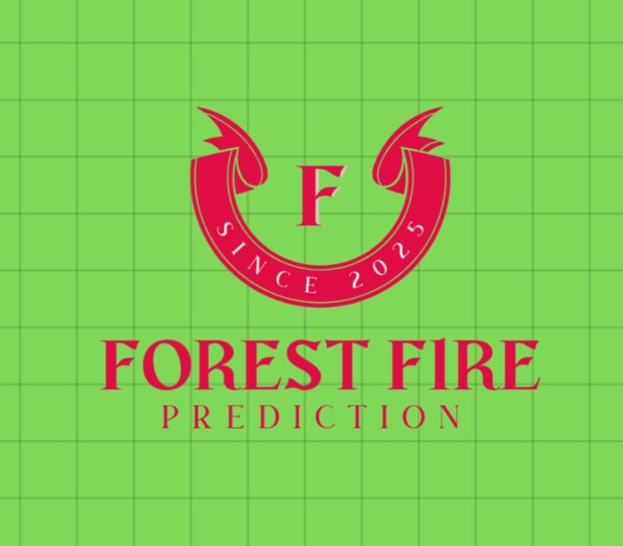
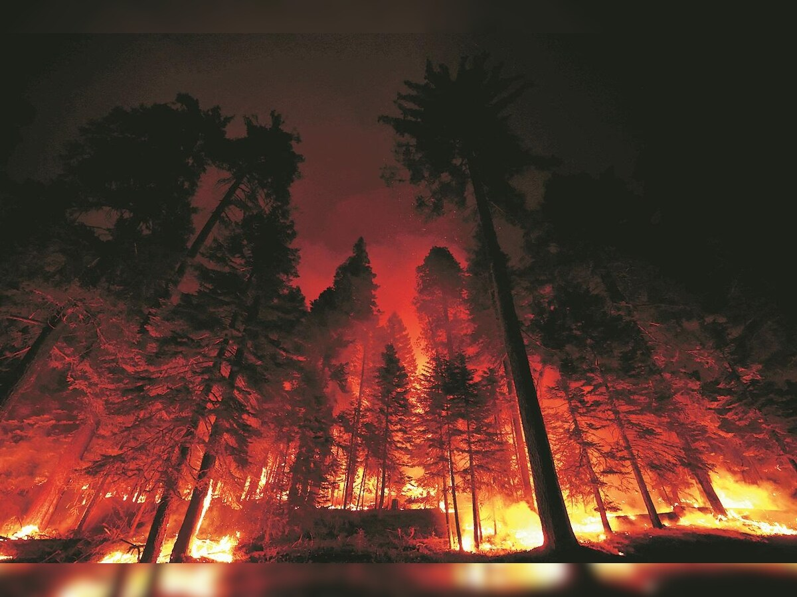
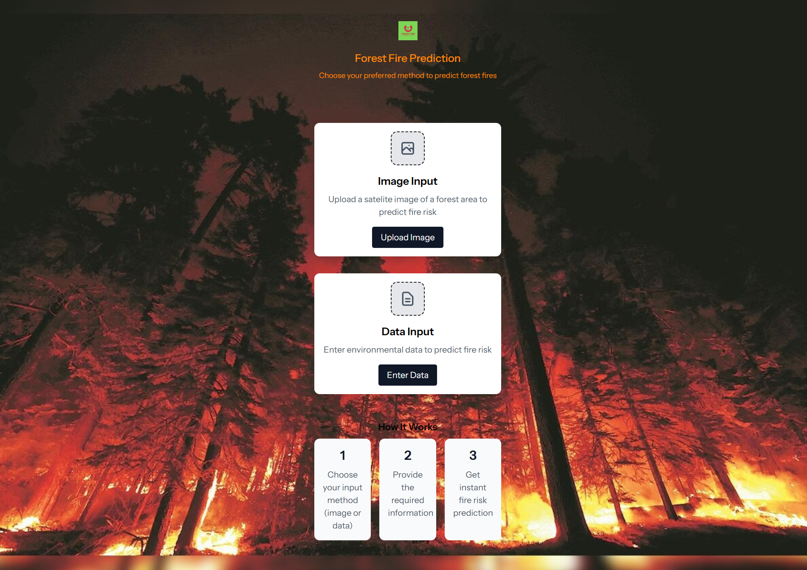
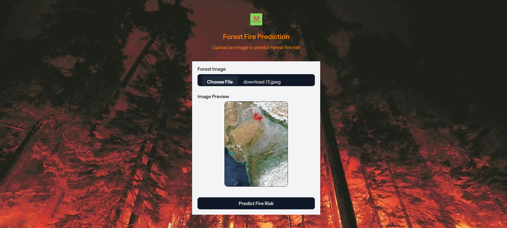
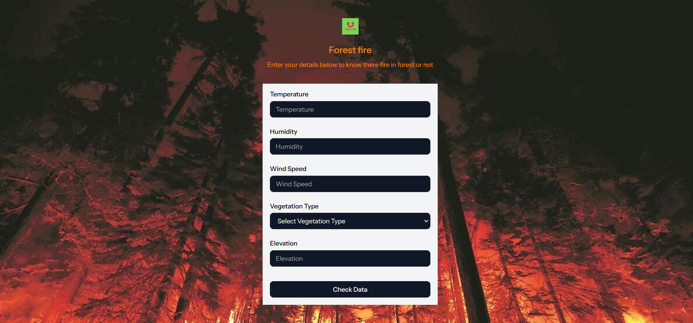

#  Forest Fire Prediction System

A comprehensive web application for predicting forest fires using machine learning models. This system analyzes environmental data and images to forecast fire risks, aiding in preventive measures and disaster management. Built for researchers, forest managers, and emergency responders.

---

## 🧩 Table of Contents

- [Demo](#-demo)
- [Screenshots](#-screenshots)
- [Features](#-features)
- [Tech Stack](#-tech-stack)
- [Installation](#-installation)
- [Run Locally](#-run-locally)
- [Environment Variables](#-environment-variables)
- [Deployment](#-deployment)
- [Contributing](#-contributing)
- [Authors](#-authors)
- [License](#-license)
- [Feedback](#-feedback)

---

## 🚀 Demo

[Forest Fire Prediction](https://forest-fire-detection-rugt.onrender.com)

For IVR(Interactive Voice Interface) Contact with me

---

## 🖼 Screenshots







---

## ⚙️ Features

- **Data-based Fire Prediction**: Predict fire risk using environmental parameters like temperature, humidity, wind speed, etc.
- **Image-based Fire Prediction**: Upload images to detect fire presence using computer vision models.
- **Interactive Web Interface**: User-friendly React-based frontend with Inertia.js for seamless navigation.
- **IVR Integration**: Interactive Voice Response system for accessibility.
- **Docker Support**: Containerized deployment for easy setup and scalability.
- **Real-time Predictions**: Console commands for automated fire prediction runs.
- **Responsive Design**: Works across devices with light/dark mode support.

---

## 🧠 Tech Stack

**Frontend:** React, TypeScript, Inertia.js, TailwindCSS\
**Backend:** Laravel (PHP)\
**ML Libraries:** Scikit-learn, TensorFlow\
**Deployment:** Docker, Docker Compose\

---

## 🛠 Installation

Clone the repository and install dependencies.

```bash
# Clone the project
git clone https://github.com/your-username/forest-fire-prediction.git

# Go to the project directory
cd forest-fire-prediction

# Install PHP dependencies
composer install

# Install Node.js dependencies
npm install
npm run build

# Install Python dependencies for ML backend
cd backend && pip install -r backend/requirement.txt

# To migrate with database
php artisan migrate

# To use for upload and use image
php artisan storage:link
```

---

## 💻 Run Locally

### Using Docker (Recommended)

```bash
# Start all services
docker-compose up -d

# Run database migrations
docker-compose exec app php artisan migrate

# Build frontend assets
docker-compose exec app npm run build
```

### Manual Setup

Start the Laravel backend:

```bash
composer run dev
```

Your app should now be running at:\
Frontend → [http://localhost:8000](http://localhost:8000)

---

## 🔑 Environment Variables

```bash
cp .env.example .env
php artisan generate:key
```

Edit `.env` file in the root directory with:
```
# for IVR
TWILIO_SID=write_twilio_sid
TWILIO_AUTH_TOKEN=write_twilio_auth_token
TWILIO_PHONE_NUMBER=+Write_phone_number
```

---

## 🚢 Deployment

### Using Docker

```bash
# Build and deploy
docker-compose -f docker-compose.prod.yml up -d

# Run migrations on production
docker-compose -f docker-compose.prod.yml exec app php artisan migrate --force
```

### Traditional Deployment

1. Set up a web server (Apache/Nginx) with PHP support.
2. Configure database and environment variables.
3. Run `composer install --optimize-autoloader --no-dev`
4. Run `npm run build`

For cloud deployment, consider services like AWS, DigitalOcean, Render, Railway or Heroku with Docker support.

---

## 🤝 Contributing

Contributions are always welcome!

1. Fork the repo
2. Create a feature branch:
   ```bash
   git checkout -b feature/your-feature-name
   ```
3. Commit your changes:
   ```bash
   git commit -m "Added new feature"
   ```
4. Push to the branch:
   ```bash
   git push origin feature/your-feature-name
   ```
5. Open a Pull Request

Please ensure your code follows the project's coding standards and includes tests.

---

## 👥 Authors

- [@your-github-username](https://github.com/your-github-username)

---

## 📜 License

This project is licensed under the **MIT License**.\
You’re free to use, modify, and distribute this project with proper attribution.

---

## 💬 Feedback

If you have any feedback or suggestions, feel free to reach out:\
📧 [shibadiptapal@gmail.com](mailto\:shibadiptapal@gmail.com)\
💬 or open an issue on [GitHub Issues](https://github.com/Shibu-pal/Forest-fire-detection/issues)

